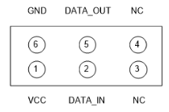
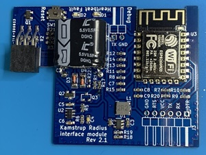

# Kamstrup-Radius component for ESPHome
ESPHome component for Kamstrup electricity meters provided by Radius in Denmark.

This project replaces [Kamstrup-Radius-Interface.](https://github.com/Asbjoern/Kamstrup-Radius-Interface)

## This project uses:
* Relevant files from mbed TLS library https://tls.mbed.org/
* Modified mbusparser library from Jalla2000's norwegian project https://github.com/jalla2000/kamstrup-mqtt

## Hardware: 
Connect any 3.3V ESP module's RX pin to the HAN DATA_OUT pin, and GND to GND.\
\
Alternatively, use a HAN module with an ESP module. There are many designs available..\
\
A design with ESP8266 compatible with the example file can be found in https://github.com/Asbjoern/Kamstrup-Radius-Interface/tree/master/pcb.
Since the HAN port only allows a 75mA power draw, there is a circuit to limit the power and charge a supercapacitor for peak currents. The ESP module is supplied with a lower voltage to limit the overall power drawn, eliminating the need for sleep modes.

Please note that the Heartbeat and Fault LED are not implemented in this component to ensure universal compatibility.

## Configuration:
See [example_kamstrup-radius.yaml](example_kamstrup-radius.yaml) for the full configuration file compatible with the module above..

```
external_components:
  source: github://Asbjoern/ESPHome-Kamstrup-Radius@main

uart:
  rx_pin: GPIO13
  baud_rate: 2400

sensor:
  - platform: kamstrup-radius
    encryptionkey: "5AD84121D9D20B364B7A11F3C1B5827F"
    authenticationkey: "AFB3F93E3E7204EDB3C27F96DBD51AE0"
    activepowerimport:
      name: "Active power Import"
    activepowerexport:
      name: "Active power Export"
    activepowerimportl1:
      name: "Active power Import L1"
    activepowerexportl1:
      name: "Active power Export L1"
    activepowerimportl2:
      name: "Active power Import L2"
    activepowerexportl2:
      name: "Active power Export L2"
    activepowerimportl3:
      name: "Active power Import L3"
    activepowerexportl3:
      name: "Active power Export L3"
    reactivepowerimport:
      name: "Reactive power Import"
    reactivepowerexport:
      name: "Reactive power Export"
    powerfactorl1:
      name: "Power factor L1"
    powerfactorl2:
      name: "Power factor L2"
    powerfactorl3:
      name: "Power factor L3"
    powerfactortotal:
      name: "Power factor Total"
    voltagel1:
      name: "RMS voltage L1"
    voltagel2:
      name: "RMS voltage L2"
    voltagel3:
      name: "RMS voltage L3"
    currentl1:
      name: "RMS current L1"
    currentl2:
      name: "RMS current L2"
    currentl3:
      name: "RMS current L3" 
    activeenergyimport:
      name: "Active energy Import"
    activeenergyexport:
      name: "Active energy Export"
    activeenergyimportl1:
      name: "Active energy Import L1"
    activeenergyexportl1:
      name: "Active energy Export L1"
    activeenergyimportl2:
      name: "Active energy Import L2"
    activeenergyexportl2:
      name: "Active energy Export L2"
    activeenergyimportl3:
      name: "Active energy Import L3"
    activeenergyexportl3:
      name: "Active energy Export L3"
    reactiveenergyimport:
      name: "Reactive energy Import"
    reactiveenergyexport:
      name: "Reactive energy Export"
```

Only **encryptionkey** and **authenticationkey** are required. The rest is optional and depends on what data is needed.